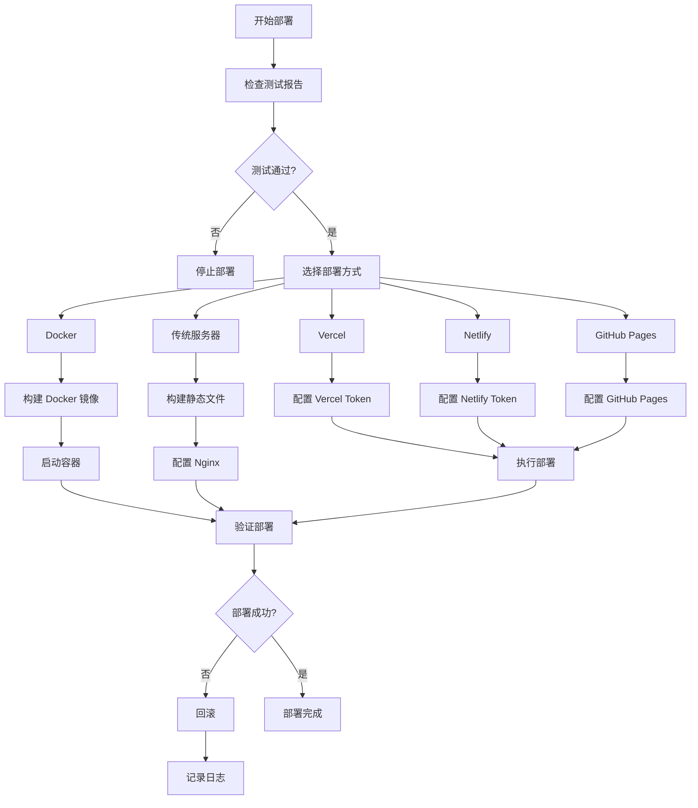

# 部署文件清单

**项目名称**: 待办事项列表应用 (To-Do List App)
**生成日期**: 2026-03-31
**运维工程师**: 小虾米

---

## 部署配置文件

### 1. 容器化配置

| 文件 | 路径 | 说明 |
|------|------|------|
| Dockerfile | `/Dockerfile` | 多阶段构建配置 |
| docker-compose.yml | `/docker-compose.yml` | 容器编排配置 |
| nginx.conf | `/nginx.conf` | Nginx 配置文件 |
| .dockerignore | `/.dockerignore` | Docker 构建忽略规则 |

**说明**:
- Dockerfile 使用多阶段构建,构建阶段基于 node:20-alpine,运行阶段基于 nginx:alpine
- docker-compose.yml 配置了健康检查、网络、安全加固等
- nginx.conf 包含 Gzip 压缩、静态缓存、安全头等优化配置

---

### 2. CI/CD 配置

| 文件 | 路径 | 说明 |
|------|------|------|
| deploy.yml | `.github/workflows/deploy.yml` | GitHub Pages/Vercel/Netlify 部署 |
| docker-build.yml | `.github/workflows/docker-build.yml` | Docker 镜像构建与推送 |

**说明**:
- deploy.yml 支持多平台部署(GitHub Pages/Vercel/Netlify)
- docker-build.yml 支持 Docker 镜像构建和推送
- 两个 workflow 均在 push to main 时触发

---

### 3. 环境变量配置

| 文件 | 路径 | 说明 |
|------|------|------|
| .env.example | `/.env.example` | 环境变量示例 |
| .gitignore | `/.gitignore` | Git 忽略规则 |

**说明**:
- .env.example 包含所有可配置的环境变量
- .gitignore 排除敏感文件和构建产物
- 实际环境变量不会提交到代码仓库

---

### 4. 部署文档

| 文件 | 路径 | 说明 |
|------|------|------|
| deploy-guide.md | `docs/devops-engineer/deploy-guide.md` | 详细部署指南 |
| deploy-log.md | `docs/devops-engineer/deploy-log.md` | 部署日志记录 |
| deploy-checklist.md | `docs/devops-engineer/deploy-checklist.md` | 部署前检查清单 |
| deploy-manifest.md | `docs/devops-engineer/deploy-manifest.md` | 部署文件清单(本文件) |

**说明**:
- deploy-guide.md: 包含 5 种部署方式的详细步骤
- deploy-log.md: 记录部署过程和结果
- deploy-checklist.md: 部署前检查清单
- deploy-manifest.md: 所有部署相关文件的清单

---

### 5. 部署脚本

| 文件 | 路径 | 说明 |
|------|------|------|
| deploy.sh | `/deploy.sh` | 快速部署脚本 |

**说明**:
- 自动化部署流程
- 支持多种部署方式
- 包含依赖检查、构建、部署等功能

---

## 部署平台支持

### 1. Vercel (推荐)

**配置文件**: `.github/workflows/deploy.yml`

**环境变量**:
- `VERCEL_TOKEN` (可选)
- `VERCEL_ORG_ID` (可选)
- `VERCEL_PROJECT_ID` (可选)

**部署方式**:
- 通过 GitHub 连接(推荐)
- 通过 Vercel CLI
- 通过 GitHub Actions

**优点**:
- 零配置,自动 HTTPS
- 全球 CDN 加速
- 免费 SSL 证书

---

### 2. Netlify

**配置文件**: `.github/workflows/deploy.yml`

**环境变量**:
- `NETLIFY_AUTH_TOKEN` (可选)
- `NETLIFY_SITE_ID` (可选)

**部署方式**:
- 通过 GitHub 连接(推荐)
- 拖拽部署
- 通过 Netlify CLI

**优点**:
- 零配置,简单易用
- Form 处理功能
- Serverless Functions

---

### 3. GitHub Pages

**配置文件**: `.github/workflows/deploy.yml`

**环境变量**:
- `GITHUB_TOKEN` (自动提供)

**部署方式**:
- 通过 GitHub Actions 自动部署

**优点**:
- 完全免费
- 与 GitHub 深度集成
- 适合开源项目

---

### 4. Docker

**配置文件**: `Dockerfile`, `docker-compose.yml`

**环境变量**: 无

**部署方式**:
- 手动构建和运行
- Docker Compose 编排
- Kubernetes 编排(可扩展)

**优点**:
- 完全控制
- 易于扩展
- 适合企业环境

---

### 5. 传统服务器 + Nginx

**配置文件**: `nginx.conf`

**环境变量**: 无

**部署方式**:
- 手动构建和部署
- 使用 CI/CD 自动化

**优点**:
- 完全控制
- 成本低
- 适合传统环境

---

## 部署流程图



---

## 部署命令速查

### Vercel

```bash
# 安装 CLI
npm install -g vercel

# 登录
vercel login

# 部署
vercel --prod
```

### Netlify

```bash
# 安装 CLI
npm install -g netlify-cli

# 登录
netlify login

# 部署
netlify deploy --prod --dir=src/frontend/dist
```

### Docker

```bash
# 构建镜像
docker-compose build

# 启动容器
docker-compose up -d

# 查看日志
docker-compose logs -f

# 停止容器
docker-compose down
```

### 本地构建

```bash
# 安装依赖
cd src/frontend && npm install

# 构建
npm run build

# 预览
npm run preview
```

---

## 部署验证清单

- [ ] 页面正常加载
- [ ] 可以创建任务
- [ ] 可以编辑任务
- [ ] 可以删除任务
- [ ] 可以标记完成/未完成
- [ ] 数据持久化正常
- [ ] 过滤功能正常
- [ ] 响应式设计正常
- [ ] HTTPS 正常工作
- [ ] 无控制台错误

---

## 监控与维护

### 日志位置

- **Vercel**: Vercel 控制台 → Functions Logs
- **Netlify**: Netlify 控制台 → Functions
- **Docker**: `docker-compose logs frontend`
- **传统服务器**: `/var/log/nginx/access.log` 和 `/var/log/nginx/error.log`

### 健康检查

```bash
# 检查服务状态
curl -I https://yourdomain.com

# 检查响应时间
time curl -s https://yourdomain.com > /dev/null
```

### 回滚命令

详见 `docs/devops-engineer/deploy-guide.md` 第 6 节。

---

## 常见问题

详见 `docs/devops-engineer/deploy-guide.md` 第 7 节。

---

## 联系方式

如有部署问题,请联系:
- **运维工程师**: 小虾米
- **文档版本**: v0.1.1
- **最后更新**: 2026-03-31

---

**清单结束**
