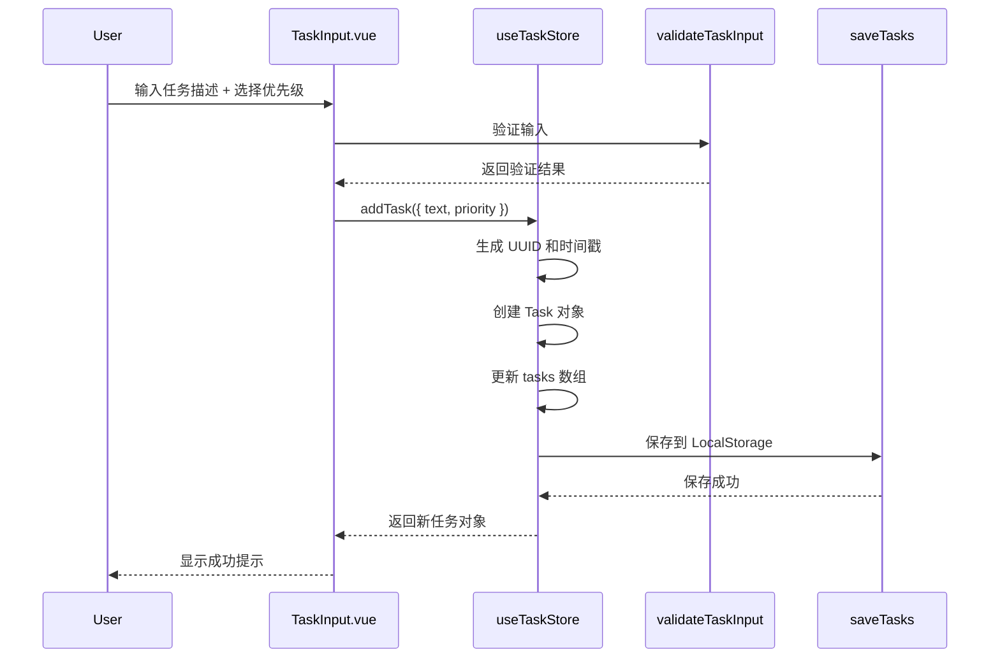
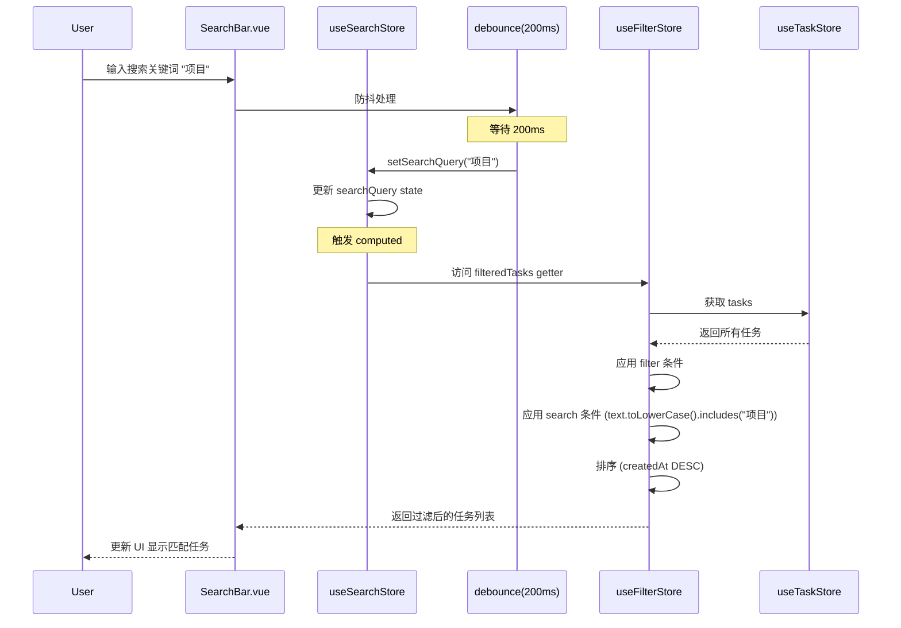

# API 接口规范文档
**项目名称**: 待办事项列表应用 (To-Do List App)
**文档版本**: v0.2.0
**创建日期**: 2026-04-01
**架构师**: 小虾米

---

## 说明

本文档定义了待办事项列表应用的内部 API 规范。

**注意**: 本应用为纯前端应用,所有 API 都是内部 JavaScript/TypeScript 函数调用,而非 HTTP RESTful API。

---

## 全局约定

### 数据类型定义

```typescript
/**
 * 任务优先级
 */
export type TaskPriority = 'high' | 'medium' | 'low'

/**
 * 任务完成状态
 */
export type TaskStatus = 'completed' | 'uncompleted'

/**
 * 过滤器类型
 */
export type FilterType = 'all' | 'uncompleted' | 'completed'

/**
 * 任务数据结构
 */
export interface Task {
  id: string                    // UUID v4
  text: string                  // 任务描述 (1-200 字符)
  status: TaskStatus            // 完成状态
  priority: TaskPriority        // 优先级
  createdAt: number             // 创建时间 (Unix timestamp, 毫秒)
  updatedAt: number             // 更新时间 (Unix timestamp, 毫秒)
  completedAt?: number          // 完成时间 (可选)
}

/**
 * 创建任务输入
 */
export type CreateTaskInput = {
  text: string
  priority?: TaskPriority
}

/**
 * 更新任务输入
 */
export type UpdateTaskInput = Partial<{
  text: string
  status: TaskStatus
  priority: TaskPriority
  completedAt: number
}>
```

### 错误处理

所有 API 函数在失败时抛出 `Error` 异常,调用方需要使用 `try-catch` 捕获。

```typescript
try {
  await taskStore.addTask({ text: '新任务' })
} catch (error) {
  console.error('添加任务失败:', error.message)
}
```

---

## API 清单

### 1. Store API (Pinia Stores)

#### 1.1 useTaskStore

任务状态管理 Store。

**State:**
```typescript
{
  tasks: Task[]           // 任务列表
  loading: boolean        // 加载状态
  error: string | null    // 错误信息
}
```

**Getters:**
```typescript
// 已完成的任务
completedTasks(): Task[]

// 未完成的任务
uncompletedTasks(): Task[]

// 任务总数
taskCount(): number

// 未完成任务数
uncompletedCount(): number
```

**Actions:**

##### `loadTasks(): Promise<void>`
加载任务列表从 LocalStorage。

- **返回**: `Promise<void>`
- **抛出异常**: 当 LocalStorage 读取失败时
- **示例**:
  ```typescript
  await taskStore.loadTasks()
  ```

##### `addTask(input: CreateTaskInput): Promise<Task>`
创建新任务。

- **参数**:
  - `input.text`: 任务描述 (必填)
  - `input.priority`: 任务优先级 (可选,默认 'medium')
- **返回**: `Promise<Task>` - 新创建的任务对象
- **抛出异常**:
  - 当输入验证失败时 (空文本、超长等)
  - 当 LocalStorage 保存失败时
- **示例**:
  ```typescript
  const newTask = await taskStore.addTask({
    text: '完成项目文档',
    priority: 'high'
  })
  ```

##### `updateTask(id: string, updates: UpdateTaskInput): Promise<Task>`
更新任务。

- **参数**:
  - `id`: 任务 ID
  - `updates.text`: 新的任务描述 (可选)
  - `updates.status`: 新的状态 (可选)
  - `updates.priority`: 新的优先级 (可选)
- **返回**: `Promise<Task>` - 更新后的任务对象
- **抛出异常**:
  - 当任务不存在时
  - 当输入验证失败时
  - 当 LocalStorage 保存失败时
- **示例**:
  ```typescript
  await taskStore.updateTask('task-id', {
    text: '修改后的描述',
    priority: 'high'
  })
  ```

##### `deleteTask(id: string): Promise<void>`
删除任务。

- **参数**:
  - `id`: 任务 ID
- **返回**: `Promise<void>`
- **抛出异常**: 当 LocalStorage 保存失败时
- **示例**:
  ```typescript
  await taskStore.deleteTask('task-id')
  ```

##### `toggleTaskStatus(id: string): Promise<Task>`
切换任务完成状态。

- **参数**:
  - `id`: 任务 ID
- **返回**: `Promise<Task>` - 更新后的任务对象
- **抛出异常**:
  - 当任务不存在时
  - 当 LocalStorage 保存失败时
- **示例**:
  ```typescript
  await taskStore.toggleTaskStatus('task-id')
  ```

##### `clearAllTasks(): Promise<void>`
清空所有任务。

- **返回**: `Promise<void>`
- **抛出异常**: 当 LocalStorage 保存失败时
- **示例**:
  ```typescript
  await taskStore.clearAllTasks()
  ```

---

#### 1.2 useFilterStore

过滤器状态管理 Store。

**State:**
```typescript
{
  currentFilter: FilterType  // 当前过滤器 ('all' | 'uncompleted' | 'completed')
}
```

**Getters:**
```typescript
// 当前过滤器显示名称
filterLabel(): string  // '全部' | '未完成' | '已完成'

// 过滤后的任务列表 (包含搜索逻辑)
filteredTasks(): Task[]
```

**Actions:**

##### `loadFilter(): void`
从 LocalStorage 加载过滤器状态。

- **返回**: `void`
- **示例**:
  ```typescript
  filterStore.loadFilter()
  ```

##### `setFilter(filter: FilterType): void`
设置过滤器状态。

- **参数**:
  - `filter`: 过滤器类型 ('all' | 'uncompleted' | 'completed')
- **返回**: `void`
- **示例**:
  ```typescript
  filterStore.setFilter('uncompleted')
  ```

---

#### 1.3 useSearchStore

搜索状态管理 Store (v0.2.0 新增)。

**State:**
```typescript
{
  searchQuery: string  // 搜索关键词
}
```

**Getters:**
```typescript
// 是否正在搜索
isSearching(): boolean  // searchQuery.length > 0
```

**Actions:**

##### `setSearchQuery(query: string): void`
设置搜索关键词。

- **参数**:
  - `query`: 搜索关键词
- **返回**: `void`
- **说明**: 此方法通常在 SearchBar 组件中使用防抖调用
- **示例**:
  ```typescript
  searchStore.setSearchQuery('项目')
  ```

##### `clearSearchQuery(): void`
清空搜索关键词。

- **返回**: `void`
- **示例**:
  ```typescript
  searchStore.clearSearchQuery()
  ```

---

### 2. Utility API (工具函数)

#### 2.1 Storage API

LocalStorage 封装函数。

##### `loadTasks(): Task[]`
从 LocalStorage 读取任务列表。

- **返回**: `Task[]` - 任务列表,空数据时返回空数组
- **说明**: 自动处理数据格式验证和兼容性
- **示例**:
  ```typescript
  const tasks = loadTasks()
  ```

##### `saveTasks(tasks: Task[]): void`
保存任务列表到 LocalStorage。

- **参数**:
  - `tasks`: 任务列表
- **返回**: `void`
- **抛出异常**:
  - 当 LocalStorage 不可用时
  - 当存储空间不足时 (QuotaExceededError)
- **示例**:
  ```typescript
  saveTasks(taskList)
  ```

##### `loadFilter(): string`
从 LocalStorage 读取过滤器状态。

- **返回**: `string` - 过滤器值,默认 'all'
- **示例**:
  ```typescript
  const filter = loadFilter()
  ```

##### `saveFilter(filter: string): void`
保存过滤器状态到 LocalStorage。

- **参数**:
  - `filter`: 过滤器值
- **返回**: `void`
- **示例**:
  ```typescript
  saveFilter('uncompleted')
  ```

##### `generateUUID(): string`
生成 UUID v4。

- **返回**: `string` - UUID 字符串
- **示例**:
  ```typescript
  const id = generateUUID()
  ```

##### `isLocalStorageAvailable(): boolean`
检测 LocalStorage 是否可用。

- **返回**: `boolean` - true 表示可用
- **示例**:
  ```typescript
  if (isLocalStorageAvailable()) {
    // 使用 LocalStorage
  }
  ```

---

#### 2.2 Validation API

输入验证函数。

##### `validateTaskInput(text: string): { valid: boolean; error?: string }`
验证任务输入。

- **参数**:
  - `text`: 任务文本
- **返回**: 验证结果对象
  - `valid`: 是否通过验证
  - `error`: 错误信息 (验证失败时)
- **验证规则**:
  - 不能为空
  - 不能超过 200 字符
  - 不能只包含空格
- **示例**:
  ```typescript
  const result = validateTaskInput('新任务')
  if (!result.valid) {
    console.error(result.error)
  }
  ```

---

#### 2.3 Search API (v0.2.0 新增)

搜索相关工具函数。

##### `searchTasks(tasks: Task[], query: string): Task[]`
根据关键词搜索任务。

- **参数**:
  - `tasks`: 任务列表
  - `query`: 搜索关键词
- **返回**: `Task[]` - 匹配的任务列表
- **说明**:
  - 不区分大小写
  - 在任务描述中进行模糊匹配
  - 空关键词返回所有任务
- **示例**:
  ```typescript
  const results = searchTasks(allTasks, '项目')
  ```

##### `highlightMatch(text: string, query: string): string`
高亮匹配的文本。

- **参数**:
  - `text`: 原始文本
  - `query`: 搜索关键词
- **返回**: `string` - 包含 HTML 高亮标记的文本
- **说明**: 使用 `<mark>` 标签包裹匹配部分
- **示例**:
  ```typescript
  const highlighted = highlightMatch('完成项目文档', '项目')
  // 返回: '完成<mark>项目</mark>文档'
  ```

---

#### 2.4 Debounce API (v0.2.0 新增)

防抖函数。

##### `debounce<T>(fn: Function, delay: number): Function`
创建防抖函数。

- **参数**:
  - `fn`: 要防抖的函数
  - `delay`: 延迟时间 (毫秒)
- **返回**: `Function` - 防抖后的函数
- **说明**: 常用于搜索输入框,减少计算次数
- **示例**:
  ```typescript
  const debouncedSearch = debounce((query: string) => {
    searchStore.setSearchQuery(query)
  }, 200)

  inputElement.addEventListener('input', (e) => {
    debouncedSearch(e.target.value)
  })
  ```

---

### 3. Component API (组件接口)

#### 3.1 TaskInput.vue

任务输入框组件。

**Props:**
```typescript
{
  // 无 Props
}
```

**Emits:**
```typescript
{
  // 无 Emits (直接调用 Store)
}
```

**Expose:**
```typescript
{
  focus(): void  // 聚焦输入框
}
```

**使用示例:**
```vue
<template>
  <TaskInput ref="taskInputRef" />
</template>

<script setup>
import { ref, onMounted } from 'vue'
import TaskInput from '@/components/TaskInput.vue'

const taskInputRef = ref()

onMounted(() => {
  taskInputRef.value.focus()
})
</script>
```

---

#### 3.2 TaskItem.vue

任务卡片组件。

**Props:**
```typescript
{
  task: Task           // 任务对象
}
```

**Emits:**
```typescript
{
  'toggle': (id: string) => void       // 切换状态
  'delete': (id: string) => void       // 删除任务
  'edit': (id: string) => void         // 编辑任务
}
```

**使用示例:**
```vue
<template>
  <TaskItem
    :task="task"
    @toggle="handleToggle"
    @delete="handleDelete"
    @edit="handleEdit"
  />
</template>
```

---

#### 3.3 SearchBar.vue (v0.2.0 新增)

搜索框组件。

**Props:**
```typescript
{
  placeholder?: string  // 占位符文本,默认 "搜索任务..."
}
```

**Emits:**
```typescript
{
  // 无 Emits (直接调用 SearchStore)
}
```

**Expose:**
```typescript
{
  focus(): void  // 聚焦搜索框
  clear(): void  // 清空搜索
}
```

**使用示例:**
```vue
<template>
  <SearchBar
    ref="searchBarRef"
    placeholder="搜索我的任务..."
  />
</template>

<script setup>
import { ref } from 'vue'
import SearchBar from '@/components/SearchBar.vue'

const searchBarRef = ref()

// 聚焦搜索框 (快捷键触发)
const focusSearch = () => {
  searchBarRef.value.focus()
}
</script>
```

---

#### 3.4 PrioritySelector.vue (v0.2.0 新增)

优先级选择器组件。

**Props:**
```typescript
{
  modelValue: TaskPriority  // 当前选中的优先级 (v-model)
}
```

**Emits:**
```typescript
{
  'update:modelValue': (value: TaskPriority) => void  // 优先级变化
}
```

**使用示例:**
```vue
<template>
  <PrioritySelector
    v-model="selectedPriority"
  />
</template>

<script setup>
import { ref } from 'vue'
import PrioritySelector from '@/components/PrioritySelector.vue'

const selectedPriority = ref('medium')
</script>
```

---

## 4. 数据流图

### 4.1 创建任务数据流



### 4.2 搜索任务数据流 (v0.2.0)



---

## 5. 错误码定义

| 错误类型 | 错误信息 | 触发场景 | 处理建议 |
|---------|---------|---------|---------|
| ValidationError | "任务内容不能为空" | 输入为空或只包含空格 | 提示用户输入有效内容 |
| ValidationError | "任务内容不能超过 200 字符" | 输入超过 200 字符 | 提示用户缩短文本 |
| NotFoundError | "任务不存在" | 更新/删除不存在的任务 | 检查任务 ID 是否正确 |
| StorageError | "LocalStorage 不可用" | 浏览器禁用 LocalStorage | 显示提示,考虑使用 Memory Storage |
| StorageError | "存储空间不足，请删除一些旧任务" | LocalStorage QuotaExceeded | 提示用户清理数据 |
| UnknownError | "操作失败,请重试" | 其他未知错误 | 记录日志,提示用户重试 |

---

## 6. 性能考虑

### 6.1 搜索性能

- **防抖优化**: 搜索输入使用 200ms 防抖,减少计算次数
- **计算缓存**: `filteredTasks` 使用 Vue 3 的 `computed` 自动缓存
- **算法复杂度**: 搜索使用 `Array.prototype.filter()`,时间复杂度 O(n)

### 6.2 列表渲染性能

- **虚拟滚动**: 当前版本未实现,支持 1000+ 任务
- **Key 优化**: 使用 `task.id` 作为 `v-for` 的 key
- **v-memo**: 可在任务列表中使用 `v-memo` 优化重渲染

---

## 7. 安全考虑

### 7.1 XSS 防护

- Vue 3 自动转义 HTML,防止 XSS 攻击
- **禁止**使用 `v-html` 渲染用户输入
- 搜索高亮使用 `<mark>` 标签,需要确保 `query` 参数经过转义

### 7.2 输入验证

- 所有用户输入必须经过 `validateTaskInput` 验证
- 文本长度限制在 200 字符以内
- 禁止执行任意 JavaScript 代码

### 7.3 数据隐私

- 所有数据存储在用户本地
- 不向服务器发送任何数据
- 不使用第三方追踪脚本

---

## 8. 测试建议

### 8.1 单元测试

**Store 测试:**
- `useTaskStore.addTask()` - 测试创建任务、验证输入、保存数据
- `useTaskStore.updateTask()` - 测试更新任务、处理不存在的任务
- `useFilterStore.filteredTasks` - 测试过滤和搜索组合逻辑

**工具函数测试:**
- `validateTaskInput()` - 测试边界情况 (空字符串、超长、特殊字符)
- `searchTasks()` - 测试搜索逻辑 (大小写、部分匹配、空关键词)
- `debounce()` - 测试防抖延迟

### 8.2 集成测试

**组件测试:**
- `TaskInput.vue` - 测试输入、验证、提交
- `SearchBar.vue` - 测试输入、防抖、清空
- `PrioritySelector.vue` - 测试选择、v-model 绑定

**用户流程测试:**
1. 创建任务 → 选择优先级 → 添加 → 验证数据保存
2. 搜索任务 → 输入关键词 → 验证过滤结果 → 清空搜索
3. 编辑任务 → 修改优先级 → 保存 → 验证更新

---

## 9. 版本历史

### v0.2.0 (2026-04-01)

**新增:**
- 新增 `useSearchStore` 搜索状态管理
- 新增 `SearchBar.vue` 搜索组件
- 新增 `PrioritySelector.vue` 优先级选择器组件
- 新增搜索相关工具函数 (`searchTasks`, `highlightMatch`)
- 新增防抖函数 (`debounce`)

**更新:**
- `useFilterStore.filteredTasks` 集成搜索逻辑
- `TaskInput.vue` 集成优先级选择器
- `TaskItem.vue` 编辑模式集成优先级选择器

**文档:**
- 初始化 API 规范文档

### v0.1.1 (2026-03-31)

- 初始版本,定义基础 Store 和 Utility API

---

**文档结束**
