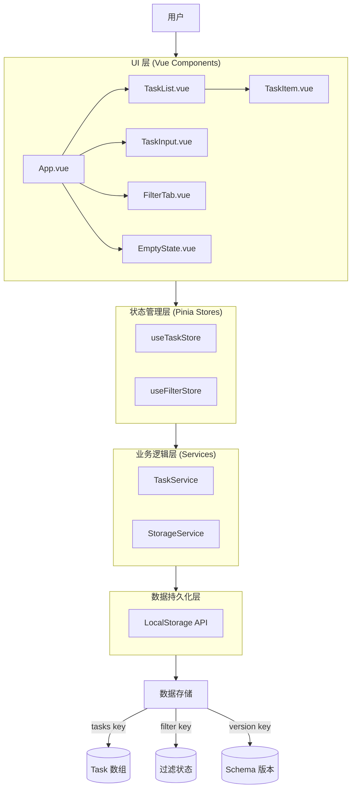
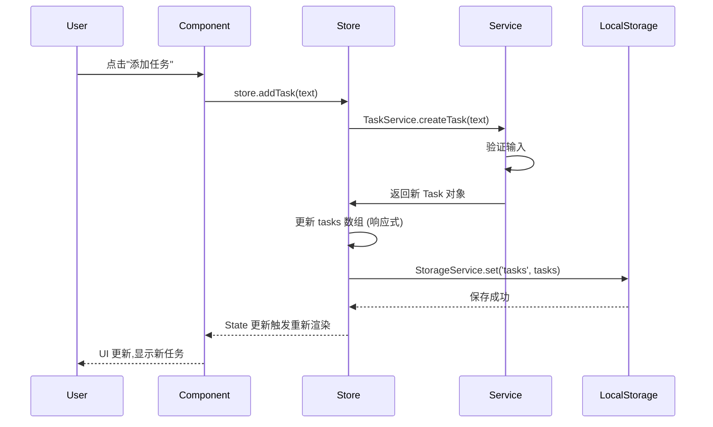
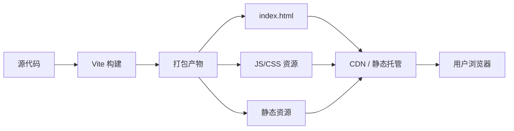

# 系统架构文档
**项目名称**: 待办事项列表应用 (To-Do List App)
**文档版本**: v0.1.1
**创建日期**: 2026-03-31
**架构师**: 小虾米

---

## 1. 技术栈选型

| 层级 | 技术 | 选型理由 |
|------|------|----------|
| 前端框架 | **Vue 3** | - 轻量级,适合单页应用<br>- Composition API 提供更好的逻辑复用<br>- 响应式系统简单高效<br>- 团队熟悉度高 |
| 构建工具 | **Vite** | - 开发时极速启动 (HMR)<br>- 生产环境优化打包<br>- 零配置开箱即用<br>- 原生 ESM 支持 |
| 状态管理 | **Pinia** | - Vue 3 官方推荐<br>- 比 Vuex 更简洁的 API<br>- TypeScript 友好<br>- 轻量级 (~1KB) |
| UI 组件库 | **原生 CSS + 部分组件按需引入** | - 应用简单,无需重型组件库<br>- 完全按照设计规范自定义<br>- 减少依赖体积<br>- 更好的性能控制 |
| CSS 方案 | **原生 CSS + CSS Variables** | - 应用规模小,无需预处理器<br>- CSS Variables 支持主题定制<br>- 避免构建复杂度<br>- 更好的浏览器原生支持 |
| 数据持久化 | **LocalStorage API** | - 浏览器原生支持,无依赖<br>- 同步 API,使用简单<br>- 容量约 5-10MB,足够存储任务数据<br>- 符合产品需求 |
| 代码规范 | **ESLint + Prettier** | - 保证代码质量一致性<br>- 自动格式化<br>- 支持 TypeScript 类型检查 |
| 测试框架 | **Vitest** | - Vite 原生测试框架<br>- 与构建工具完美集成<br>- 速度快,配置简单 |
| 类型检查 | **TypeScript** | - 提供类型安全<br>- 更好的 IDE 支持<br>- 减少运行时错误<br>- 便于重构和维护 |

---

## 2. 系统架构图



---

## 3. 模块划分

### 3.1 目录结构

```
src/
├── main.ts                    # 应用入口
├── App.vue                    # 根组件
│
├── components/                # UI 组件
│   ├── TaskList.vue          # 任务列表容器
│   ├── TaskItem.vue          # 单个任务卡片
│   ├── TaskInput.vue         # 任务输入框
│   ├── FilterTab.vue         # 过滤器 Tab
│   └── EmptyState.vue        # 空状态提示
│
├── stores/                    # Pinia 状态管理
│   ├── task.ts               # 任务状态 Store
│   └── filter.ts             # 过滤器状态 Store
│
├── services/                  # 业务逻辑层
│   ├── task.service.ts       # 任务业务逻辑
│   └── storage.service.ts    # LocalStorage 封装
│
├── types/                     # TypeScript 类型定义
│   ├── task.types.ts         # Task 相关类型
│   └── storage.types.ts      # Storage 相关类型
│
├── utils/                     # 工具函数
│   ├── validation.ts         # 输入验证
│   ├── date.ts               # 日期处理
│   └── constants.ts          # 常量定义
│
├── assets/                    # 静态资源
│   └── styles/               # 全局样式
│       ├── variables.css     # CSS 变量
│       ├── reset.css         # 样式重置
│       └── global.css        # 全局样式
│
└── router/                    # 路由 (未来扩展)
    └── index.ts
```

### 3.2 模块职责

#### UI 层 (Components)
- **职责**: 负责 UI 渲染和用户交互
- **对外接口**: Props, Emits
- **依赖模块**: Pinia Stores
- **特点**: 无状态,纯展示组件

**核心组件:**
- `TaskList.vue`: 任务列表容器,负责渲染任务列表
- `TaskItem.vue`: 单个任务卡片,包含复选框、编辑、删除功能
- `TaskInput.vue`: 任务输入框,负责创建新任务
- `FilterTab.vue`: 过滤器 Tab,负责切换过滤状态
- `EmptyState.vue`: 空状态提示,引导用户创建第一个任务

#### 状态管理层 (Stores - Pinia)
- **职责**: 管理应用状态,提供响应式数据
- **对外接口**: State, Getters, Actions
- **依赖模块**: Services 层

**Store 定义:**
- `useTaskStore`: 管理任务列表状态
  - State: tasks, loading, error
  - Actions: addTask, updateTask, deleteTask, toggleTaskStatus, loadTasks, saveTasks
  - Getters: completedTasks, uncompletedTasks, tasksByPriority

- `useFilterStore`: 管理过滤器状态
  - State: currentFilter ('all' | 'uncompleted' | 'completed')
  - Actions: setFilter
  - Getters: filteredTasks

#### 业务逻辑层 (Services)
- **职责**: 封装业务逻辑和数据操作
- **对外接口**: 纯函数和类方法
- **依赖模块**: LocalStorage API

**Service 定义:**
- `TaskService`: 任务相关业务逻辑
  - `createTask(text, priority)`: 创建新任务
  - `updateTask(id, updates)`: 更新任务
  - `deleteTask(id)`: 删除任务
  - `toggleTaskStatus(id)`: 切换任务状态
  - `validateTaskInput(text)`: 验证输入

- `StorageService`: LocalStorage 封装
  - `get(key)`: 读取数据
  - `set(key, value)`: 保存数据
  - `remove(key)`: 删除数据
  - `checkAvailability()`: 检测 LocalStorage 可用性

---

## 4. 数据流设计

### 4.1 单向数据流



### 4.2 数据更新流程

1. **用户操作**: 用户在 UI 层进行交互 (点击、输入等)
2. **触发 Action**: 组件调用 Pinia Store 的 Action
3. **业务逻辑**: Store 调用 Service 层处理业务逻辑
4. **更新 State**: Service 返回结果,Store 更新 State
5. **数据持久化**: State 变化时自动保存到 LocalStorage
6. **UI 响应式更新**: Vue 响应式系统自动更新 UI

### 4.3 数据初始化流程

1. **应用启动**: main.ts 初始化应用
2. **创建 Store**: 创建 Pinia Store 实例
3. **加载数据**: Store 调用 StorageService.get('tasks')
4. **解析数据**: 解析 LocalStorage 中的 JSON 数据
5. **初始化 State**: 将数据加载到 Store State
6. **渲染 UI**: Vue 根据 State 渲染初始 UI

---

## 5. 数据模型

详细数据模型见 `docs/software-architect/data-model.md`。

---

## 6. 部署拓扑

### 6.1 部署模式
**单页应用 (SPA) + 静态托管**

- 无后端服务
- 纯前端应用
- 数据存储在用户浏览器本地

### 6.2 构建流程



### 6.3 环境划分

- **开发环境 (Development)**: `npm run dev`
  - Vite 开发服务器
  - HMR 热更新
  - Source Map 调试

- **生产环境 (Production)**: `npm run build`
  - 静态资源打包
  - 代码压缩混淆
  - Tree-shaking 优化
  - 部署到 CDN

### 6.4 部署平台选项

1. **Vercel** (推荐)
   - 零配置部署
   - 自动 HTTPS
   - 全球 CDN
   - 免费 SSL 证书

2. **Netlify**
   - 拖拽部署
   - Form 处理
   - Serverless Functions

3. **GitHub Pages**
   - 免费
   - 自动部署
   - 适合开源项目

4. **传统服务器 + Nginx**
   - 完全控制
   - 适合有服务器的场景

---

## 7. 非功能需求落地方案

### 7.1 性能目标

| 指标 | 目标值 | 实现方案 |
|------|--------|----------|
| 操作响应时间 | < 100ms | - Pinia 响应式更新<br>- LocalStorage 同步 API<br>- 避免不必要的重渲染 |
| 首屏加载时间 | < 2s | - Vite 快速构建<br>- 代码分割 (Code Splitting)<br>- 按需加载组件<br>- CDN 加速 |
| 任务容量 | 支持 1000+ 任务 | - 虚拟滚动 (Virtual Scroll)<br>- 分页加载 (如需要)<br>- LocalStorage 压缩 (如需要) |

### 7.2 性能优化策略

**代码层面:**
- 使用 Vue 3 的 `v-memo` 优化列表渲染
- 避免在模板中使用复杂表达式
- 合理使用 `computed` 缓存计算结果
- 使用 `shallowRef` 和 `shallowReactive` 减少响应式开销

**构建层面:**
- Vite 自动 Tree-shaking
- 代码分割 (路由级别)
- 资源压缩 (Gzip / Brotli)
- 图片懒加载

**数据层面:**
- LocalStorage 数据分页 (如需要)
- 索引优化 (按 ID 快速查找)
- 避免频繁读写 (防抖处理)

### 7.3 高可用策略

**LocalStorage 降级:**
- 检测 LocalStorage 可用性
- 禁用时显示提示信息
- 提供 Memory Storage 备选方案 (数据不持久化)

**错误处理:**
- 全局错误捕获 (Vue error handler)
- LocalStorage Quota Exceeded 处理
- 优雅降级 UI

### 7.4 安全基线

**输入验证:**
- 所有用户输入必须验证
- 防止 XSS 攻击 (Vue 自动转义)
- 输入长度限制 (防止存储溢出)

**数据隐私:**
- 数据仅存储在用户本地
- 不向服务器发送任何数据
- 不使用第三方追踪脚本

**HTTPS:**
- 生产环境强制 HTTPS
- 部署平台自动提供 SSL 证书

---

## 8. 技术风险与应对

| 风险 | 影响 | 概率 | 应对措施 |
|------|------|------|----------|
| LocalStorage 容量不足 | 中 | 低 | - 实现数据清理机制<br>- 提示用户删除旧任务<br>- 考虑 IndexedDB 备选方案 |
| 浏览器兼容性问题 | 中 | 低 | - 使用 Babel 转译<br>- Polyfill 兼容性 API<br>- 测试主流浏览器 |
| LocalStorage 被禁用 | 高 | 低 | - 检测可用性<br>- 显示友好提示<br>- 提供 Memory Storage 降级 |
| 性能问题 (大量任务) | 中 | 中 | - 实现虚拟滚动<br>- 分页加载<br>- 数据索引优化 |

---

## 9. 待确认项

- [待确认 1] 是否需要实现虚拟滚动以支持 10000+ 任务? 【当前版本仅支持 1000+】
- [待确认 2] 是否需要实现数据导出/导入功能? 【v1.1 考虑】
- [待确认 3] 是否需要实现深色模式? 【v1.1 考虑】
- [待确认 4] LocalStorage Schema 版本控制策略? 【使用 version 字段】
- [待确认 5] 是否需要实现任务搜索功能? 【v1.1 考虑】

---

## 10. 后续扩展性考虑

虽然当前是 MVP 版本,但架构设计需考虑未来扩展:

**可扩展性:**
- Service 层可轻松替换为 API 调用 (接入后端)
- Store 层支持扩展更多状态管理
- 组件化设计支持功能模块拆分

**未来可扩展功能:**
- 云端同步 (后端 API)
- 任务分类/标签 (数据模型扩展)
- 任务搜索 (Service 层扩展)
- 数据导出/导入 (Service 层扩展)
- 深色模式 (CSS Variables 切换)
- 多设备同步 (WebSocket)

---

**文档结束**
