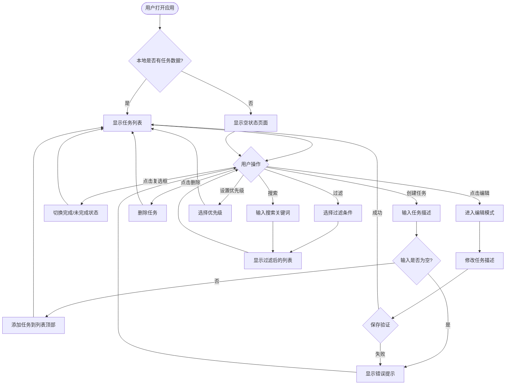

# 设计规范文档
**项目名称**: 待办事项列表应用 (To-Do List App)
**文档版本**: v0.2.0
**创建日期**: 2026-03-31
**更新日期**: 2026-04-01
**设计师**: 小虾米

---

## 1. 用户流程图

**对应文件**: `wireframes/user-flow.excalidraw`

---

## 2. 信息架构

### 2.1 页面层级
- **单页应用 (SPA)**: 所有功能在一个页面内完成
- **无多层级导航**: 无需页面跳转

### 2.2 导航逻辑
- 顶部: 应用标题 + 搜索框 + 过滤器
- 中部: 任务列表（可滚动）
- 底部: 添加任务输入框 + 优先级选择器（固定）

---

## 3. 页面设计说明

### 3.1 主视图 / 任务列表（对应 `wireframes/main-view.excalidraw`）

**布局结构:**
- 顶部栏: 固定高度 64px, 包含应用标题（左）+ 搜索框（中）+ 过滤器（右）
- 任务列表区: 可滚动区域,占据剩余空间
- 底部输入区: 固定高度 80px, 包含输入框 + 优先级选择器 + 添加按钮

**核心组件:**
- 应用标题: "我的待办事项"
- 搜索框: 图标 + 输入框 + 清除按钮
- 过滤器: Tab 切换样式（全部 / 未完成 / 已完成）
- 任务卡片: 包含复选框、任务描述、优先级标识、编辑按钮、删除按钮
- 输入框: 文本输入
- 优先级选择器: 三个优先级按钮（高/中/低）
- 添加按钮: 主操作按钮

**交互逻辑:**
- 点击复选框 → 切换任务完成状态（即时更新,有过渡动画）
- 点击编辑按钮 → 任务文本变为可编辑状态 + 保存/取消按钮出现 + 优先级可调整
- 点击删除按钮 → 任务从列表中移除（无确认弹窗,优化为撤销提示）
- 点击过滤 Tab → 列表平滑过渡到过滤状态
- 输入搜索关键词 → 实时过滤任务列表（200ms 防抖）
- 输入框回车或点击添加 → 创建新任务,使用当前选中的优先级
- 点击优先级按钮 → 切换优先级,按钮有视觉反馈

**异常状态:**
- **空状态**: 显示友好提示插图 + "暂无任务,创建一个吧!"文字（见 `wireframes/empty-state.excalidraw`）
- **加载中**: 初始加载时显示骨架屏（卡片形状闪烁效果）
- **报错**: 输入为空时,输入框下方显示红色提示文字"请输入任务内容"

---

### 3.2 空状态页面（对应 `wireframes/empty-state.excalidraw`）

**布局结构:**
- 居中插图区域: 占据 40% 高度
- 提示文字: "还没有任务,创建一个吧!"
- 底部输入框: 与主视图保持一致

**核心组件:**
- 插图: 简约风格的空状态插画（笔记本 + 笔的图标）
- 提示文字: 主标题 + 副标题"记录你的第一个任务"

**交互逻辑:**
- 输入框获得焦点时,插图有轻微缩放动画
- 创建第一个任务后,平滑过渡到任务列表视图

**异常状态:**
- 无（空状态本身就是一种异常处理）

---

### 3.3 编辑模式（内嵌于主视图）

**布局结构:**
- 任务卡片展开: 高度从 48px 扩展到 80px
- 输入框替换文本: 自动聚焦
- 操作按钮: 保存 / 取消

**核心组件:**
- 编辑输入框: 获得焦点时有蓝色边框
- 优先级选择器: 三个优先级按钮（高/中/低）,当前优先级高亮显示
- 保存按钮: 蓝色主按钮
- 取消按钮: 灰色次按钮

**交互逻辑:**
- 点击编辑 → 卡片展开,输入框出现并聚焦
- 点击优先级按钮 → 切换任务优先级,即时更新按钮状态
- 点击保存或按回车 → 验证后更新任务描述和优先级,折叠卡片
- 点击取消或按 ESC → 恢复原内容和优先级,折叠卡片
- 输入为空时保存 → 显示错误提示

**异常状态:**
- **输入为空**: 保存按钮禁用 + 输入框下方红色提示

---

## 4. 设计系统

### 4.1 色彩

**主色:**
- Primary Blue: `#3B82F6` (用于主按钮、链接、焦点状态)
- Primary Blue Hover: `#2563EB`
- Primary Blue Active: `#1D4ED8`

**辅助色:**
- Secondary Gray: `#6B7280` (用于次要文字、图标)
- Secondary Gray Hover: `#4B5563`

**中性色:**
- Background: `#FFFFFF` (主背景)
- Surface: `#F9FAFB` (卡片背景)
- Border: `#E5E7EB` (边框、分割线)
- Text Primary: `#111827` (主要文字)
- Text Secondary: `#6B7280` (次要文字)
- Text Disabled: `#9CA3AF` (禁用文字)

**语义色:**
- Success: `#10B981` (完成状态、成功提示)
- Warning: `#F59E0B` (高优先级)
- Error: `#EF4444` (错误提示、删除操作)
- Info: `#3B82F6` (信息提示)

**优先级色彩:**
- 高优先级: `#EF4444` (红色标签)
- 中优先级: `#F59E0B` (橙色标签)
- 低优先级: `#10B981` (绿色标签)

---

### 4.2 字体

**字体家族:**
- 系统默认字体栈: `-apple-system, BlinkMacSystemFont, 'Segoe UI', Roboto, Oxygen, Ubuntu, Cantarell, 'Fira Sans', 'Droid Sans', 'Helvetica Neue', sans-serif`

**字号:**
- H1 (应用标题): 24px / 700 (Bold)
- H2 (区块标题): 18px / 600 (SemiBold)
- Body (任务文本): 16px / 400 (Regular)
- Small (辅助文字): 14px / 400 (Regular)
- XSmall (提示文字): 12px / 400 (Regular)

**行高:**
- 标题: 1.2
- 正文: 1.5
- 辅助文字: 1.4

---

### 4.3 间距与圆角

**基础间距单位:** 4px (Base Unit = 4px)

**间距规范:**
- XS: 4px
- SM: 8px
- MD: 16px
- LG: 24px
- XL: 32px
- XXL: 48px

**圆角规范:**
- XS: 2px (标签、徽章)
- SM: 4px (按钮、输入框)
- MD: 8px (卡片)
- LG: 12px (弹窗)
- Full: 9999px (胶囊形按钮)

---

### 4.4 阴影

**阴影层级:**
- Level 1 (卡片悬停): `0 1px 3px rgba(0, 0, 0, 0.1)`
- Level 2 (浮层): `0 4px 6px rgba(0, 0, 0, 0.1)`
- Level 3 (弹窗): `0 10px 15px rgba(0, 0, 0, 0.1)`

---

## 5. 组件规范

### 5.1 按钮 (Button)

**主按钮:**
- 默认态: 背景色 `#3B82F6`,文字白色,高度 40px,内边距 12px 24px
- 悬停态: 背景色 `#2563EB`,轻微放大 (scale 1.02)
- 点击态: 背景色 `#1D4ED8`,缩小 (scale 0.98)
- 禁用态: 背景色 `#E5E7EB`,文字 `#9CA3AF`,无悬停效果

**次按钮:**
- 默认态: 背景色透明,边框 `#E5E7EB`,文字 `#374151`
- 悬停态: 背景色 `#F3F4F6`
- 点击态: 背景色 `#E5E7EB`
- 禁用态: 边框 `#E5E7EB`,文字 `#9CA3AF`

**图标按钮:**
- 尺寸: 32px × 32px
- 默认态: 背景色透明,图标 `#6B7280`
- 悬停态: 背景色 `#F3F4F6`,图标 `#374151`
- 点击态: 背景色 `#E5E7EB`

---

### 5.2 输入框 (Input)

**默认态:**
- 边框: 1px solid `#E5E7EB`
- 背景: `#FFFFFF`
- 高度: 40px
- 内边距: 10px 14px
- 圆角: 4px
- 字体: 16px Regular

**聚焦态:**
- 边框: 2px solid `#3B82F6`
- 外发光: `0 0 0 3px rgba(59, 130, 246, 0.1)`

**错误态:**
- 边框: 2px solid `#EF4444`
- 下方显示错误提示文字 (12px, `#EF4444`)

**禁用态:**
- 背景: `#F9FAFB`
- 边框: 1px solid `#E5E7EB`
- 文字: `#9CA3AF`

---

### 5.3 复选框 (Checkbox)

**默认态 (未完成):**
- 边框: 2px solid `#D1D5DB`
- 背景: `#FFFFFF`
- 尺寸: 20px × 20px
- 圆角: 4px

**选中态 (已完成):**
- 背景: `#3B82F6`
- 边框: 2px solid `#3B82F6`
- 显示白色对勾图标

**悬停态:**
- 边框颜色加深为 `#9CA3AF`

**聚焦态:**
- 外发光: `0 0 0 3px rgba(59, 130, 246, 0.1)`

---

### 5.4 任务卡片 (Task Card)

**默认态:**
- 背景: `#FFFFFF`
- 边框: 1px solid `#E5E7EB`
- 高度: 48px (折叠态)
- 圆角: 8px
- 内边距: 12px 16px
- 阴影: Level 1
- 过渡: 所有状态变化 200ms ease-in-out

**悬停态:**
- 阴影: Level 2
- 轻微上移 (translateY -2px)

**已完成态:**
- 背景: `#F9FAFB`
- 任务文字: 删除线 + 颜色 `#9CA3AF`
- 复选框: 选中态
- 不透明度: 0.8

**编辑模式:**
- 高度: 80px (展开态)
- 边框: 2px solid `#3B82F6`
- 显示输入框 + 操作按钮

---

### 5.5 优先级标签 (Priority Badge)

**高优先级:**
- 背景: `#FEF2F2`
- 文字: `#DC2626`
- 边框: 1px solid `#FECACA`
- 内边距: 2px 8px
- 圆角: 12px (胶囊形)
- 字体: 12px Medium

**中优先级:**
- 背景: `#FFFBEB`
- 文字: `#D97706`
- 边框: 1px solid `#FDE68A`

**低优先级:**
- 背景: `#ECFDF5`
- 文字: `#059669`
- 边框: 1px solid `#A7F3D0`

---

### 5.6 优先级选择器 (Priority Selector)

**设计说明:**
在创建任务和编辑任务时使用的优先级选择组件,采用分段控制器 (Segmented Control) 样式。

**默认态 (未选中任何优先级):**
- 容器: 圆角矩形,背景 `#F3F4F6`,边框 `#E5E7EB`
- 尺寸: 高度 36px,宽度自适应
- 内边距: 2px
- 三个按钮: 高 / 中 / 低,均匀分布

**按钮默认态:**
- 背景: 透明
- 文字: `#6B7280`,14px Medium
- 内边距: 6px 12px
- 圆角: 4px
- 过渡: 所有状态变化 150ms ease-in-out

**按钮选中态 - 高优先级:**
- 背景: `#FEF2F2`
- 文字: `#DC2626`
- 边框: 1px solid `#FECACA`

**按钮选中态 - 中优先级:**
- 背景: `#FFFBEB`
- 文字: `#D97706`
- 边框: 1px solid `#FDE68A`

**按钮选中态 - 低优先级:**
- 背景: `#ECFDF5`
- 文字: `#059669`
- 边框: 1px solid `#A7F3D0`

**悬停态 (未选中时):**
- 背景: `#FFFFFF`
- 文字: `#374151`

**点击态:**
- 轻微缩小 (scale 0.98)
- 背景加深 10%

**焦点态:**
- 外发光: `0 0 0 3px rgba(59, 130, 246, 0.1)`

**布局位置:**
- 创建任务时: 位于输入框和添加按钮之间
- 编辑任务时: 位于编辑输入框下方,按钮组上方

---

### 5.7 搜索框 (Search Input)

**设计说明:**
顶部搜索框,支持实时过滤任务列表。

**默认态:**
- 容器: 圆角矩形,背景 `#FFFFFF`,边框 `#E5E7EB`
- 尺寸: 高度 36px,宽度 240px (桌面端) / 100% (移动端)
- 内边距: 8px 12px (左侧预留搜索图标空间)
- 圆角: 8px

**搜索图标:**
- 位置: 左侧,距离左边缘 12px
- 颜色: `#9CA3AF`
- 尺寸: 16px × 16px

**输入文字:**
- 字体: 14px Regular
- 颜色: `#111827`
- 占位符: "搜索任务..."

**聚焦态:**
- 边框: 2px solid `#3B82F6`
- 外发光: `0 0 0 3px rgba(59, 130, 246, 0.1)`
- 背景色: `#FFFFFF`

**有内容态:**
- 显示清除按钮 (× 图标)
- 清除按钮位于右侧,距离右边缘 8px
- 清除按钮颜色: `#6B7280`
- 清除按钮悬停: `#374151`
- 清除按钮点击: 清空输入框并聚焦

**悬停态:**
- 边框颜色: `#D1D5DB`

**布局位置:**
- 桌面端: 顶部栏中央,应用标题和过滤器之间
- 移动端: 顶部栏下方,独占一行,高度 44px (更易触摸)

**交互行为:**
- 输入时实时过滤,200ms 防抖
- 按 ESC 清空搜索框
- 按 Enter 确认搜索（可选）
- 搜索无结果时显示"未找到匹配的任务"提示

---

### 5.8 过滤器 Tab (Filter Tab)

**默认态 (未选中):**
- 背景: 透明
- 文字: `#6B7280`
- 边框: 无
- 高度: 32px
- 内边距: 8px 16px

**选中态:**
- 背景: `#EFF6FF`
- 文字: `#3B82F6`
- 边框: 无
- 底部指示器: 2px 高度 `#3B82F6`

**悬停态:**
- 背景: `#F3F4F6`

---

## 6. 响应式规范

### 6.1 断点定义
- **Mobile**: < 768px
- **Desktop**: >= 768px

### 6.2 移动端适配 (< 768px)

**布局调整:**
- 顶部栏高度: 56px (搜索框单独一行,总高度 100px)
- 应用标题: 字号 18px
- 搜索框: 宽度 100%,高度 44px,位于标题下方
- 任务卡片: 内边距 12px
- 输入框: 全宽度,高度 44px (更易触摸)
- 优先级选择器: 宽度 100%,按钮均匀分布
- 按钮: 最小触摸区域 44px × 44px

**交互优化:**
- 增大点击区域
- 减少密集元素
- 底部输入框固定在屏幕底部
- 任务列表留出底部安全距离 (避免被输入框遮挡)

### 6.3 桌面端 (>= 768px)

**布局优化:**
- 顶部栏高度: 64px
- 应用标题: 字号 24px
- 搜索框: 宽度 240px,位于标题和过滤器之间
- 内容最大宽度: 800px (居中显示)
- 任务卡片: 悬停时显示操作按钮

**交互优化:**
- 支持键盘快捷键
- 悬停状态增强
- 更多空间展示信息

---

## 7. 交互说明

### 7.1 全局交互

**Loading 状态:**
- 首屏加载: 骨架屏 (3 个任务卡片形状闪烁)
- 数据保存: 无加载状态 (LocalStorage 同步,极快)

**错误提示:**
- 位置: 元素下方 (输入框) 或页面顶部 (全局错误)
- 样式: 红色背景 + 白色文字 + 关闭按钮
- 自动消失: 3 秒后淡出

**成功提示:**
- 位置: 页面顶部中央
- 样式: 绿色背景 + 白色文字 + 对勾图标
- 自动消失: 2 秒后淡出

### 7.2 微交互

**任务完成动画:**
1. 复选框从无到有 (缩放 + 旋转)
2. 对勾图标绘制 (SVG stroke 动画,300ms)
3. 任务文字变灰 + 删除线 (渐变过渡,200ms)
4. 卡片轻微缩放 (scale 0.98 → 1.0,弹跳效果)

**任务添加动画:**
1. 新任务从列表顶部滑入 (translateY -20px → 0,300ms)
2. 同时淡入 (opacity 0 → 1,300ms)
3. 弹性缓动 (cubic-bezier(0.34, 1.56, 0.64, 1))

**任务删除动画:**
1. 卡片向右滑出 (translateX 0 → 100%,200ms)
2. 同时淡出 (opacity 1 → 0,200ms)
3. 下方的任务卡片向上移动填补空缺 (平滑过渡,300ms)

**编辑模式展开动画:**
1. 卡片高度从 48px 扩展到 80px (200ms)
2. 输入框淡入 (opacity 0 → 1,150ms)
3. 优先级选择器从下方滑入 (translateY 10px → 0,200ms)
4. 按钮组从下方滑入 (translateY 10px → 0,200ms)

**优先级切换动画:**
1. 选中状态背景色渐变 (150ms ease-in-out)
2. 轻微缩放效果 (scale 0.98 → 1.0,100ms)
3. 文字颜色渐变过渡 (150ms)

**搜索框展开动画 (移动端):**
1. 点击搜索图标 → 搜索框从右向左展开 (300ms)
2. 输入框自动聚焦
3. 点击外部或按 ESC → 搜索框收起

**搜索过滤动画:**
1. 不匹配的任务卡片淡出 (opacity 1 → 0,150ms)
2. 匹配的任务卡片平滑上移填补空缺 (300ms)
3. 使用绝对定位差异动画 (FLIP 技术)

---

## 8. 无障碍设计

### 8.1 键盘导航
- Tab: 在任务卡片、输入框、按钮、优先级选择器间切换
- Enter: 提交表单 / 确认操作 / 选中优先级
- ESC: 取消编辑 / 关闭弹窗 / 清空搜索框
- Space: 切换复选框状态
- ↑/↓: 在优先级选项间切换
- Ctrl/Cmd + F: 聚焦搜索框

### 8.2 屏幕阅读器
- 所有交互元素必须有 `aria-label`
- 任务状态变化需通过 `aria-live` 区域通知
- 复选框使用 `role="checkbox"` + `aria-checked`
- 优先级选择器使用 `role="radiogroup"`,每个按钮使用 `role="radio"`
- 搜索框使用 `role="searchbox"` + `aria-label="搜索任务"`
- 搜索结果数量通过 `aria-live` 区域通知

### 8.3 色彩对比度
- 所有文字与背景对比度 >= 4.5:1 (WCAG AA 标准)
- 重要交互元素对比度 >= 7:1 (WCAG AAA 标准)

---

## 9. 动画时长规范

- **快速反馈**: 100ms (按钮点击、复选框切换)
- **标准过渡**: 200ms (颜色变化、淡入淡出)
- **布局变化**: 300ms (卡片展开、列表重排)
- **页面切换**: 400ms (路由跳转、弹窗出现)

**缓动函数:**
- 标准过渡: `ease-in-out`
- 进入动画: `ease-out` (更自然)
- 离开动画: `ease-in`

---

## 10. v0.2.0 版本更新说明

### 10.1 新增功能
1. **优先级选择器**
   - 在创建任务时可选择优先级（高/中/低）
   - 在编辑任务时可修改优先级
   - 默认优先级为"中"

2. **搜索功能**
   - 顶部搜索框支持实时过滤
   - 按任务描述关键词搜索
   - 搜索无结果时显示友好提示

3. **交互优化**
   - 优先级切换动画
   - 搜索过滤动画
   - 键盘快捷键支持

### 10.2 设计变更
- 底部输入区高度从 72px 增加到 80px（容纳优先级选择器）
- 顶部栏在移动端增加搜索框行,高度变为 100px
- 任务卡片编辑模式高度增加以容纳优先级选择器

---

## 11. 待确认项

- [待确认 1] 是否需要"撤销删除"功能?【当前版本直接删除】
- [待确认 2] 优先级标签的位置: 任务文字左侧还是右侧?【右侧】
- [待确认 3] 是否需要深色模式? 【当前版本不需要】
- [待确认 4] 任务排序逻辑: 是否支持拖拽排序? 【当前版本仅按创建时间倒序】
- [待确认 5] 空状态插图是否需要定制,还是使用通用图标库?【通用图标】
- [待确认 6] 搜索是否支持高级语法（如 AND/OR/NOT）? 【当前版本仅支持简单关键词搜索】
- [待确认 7] 优先级是否支持自定义排序（如按优先级分组显示）? 【当前版本仅按创建时间倒序】

---

**文档结束**
